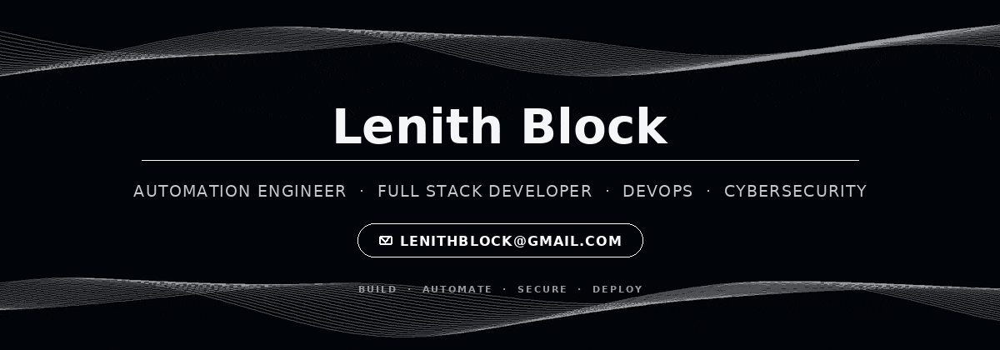
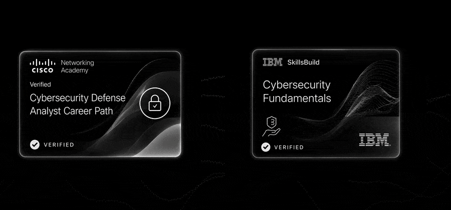

<div align="center">





<br/>

### Construyo software, automatizaciones y sistemas que reducen trabajo manual.

Me enfoco en **desarrollo full stack**, **automatización de procesos** y soluciones prácticas para negocios.  
Actualmente estoy profundizando en **Cybersecurity** y **DevOps**, incorporando redes, seguridad, Linux, Docker y prácticas de infraestructura a mi perfil.

</div>

---

## Qué hago

<table>
<tr>
<td width="33%" valign="top">

### ⚙ Automation

Diseño workflows y procesos automáticos para conectar servicios, reducir tareas repetitivas y mejorar operaciones.

</td>
<td width="33%" valign="top">

### ◫ Full Stack

Desarrollo aplicaciones web, APIs, herramientas internas y sistemas orientados a resolver problemas reales.

</td>
<td width="33%" valign="top">

### ⛨ Security & DevOps

Estoy ampliando mi stack hacia seguridad, redes, Linux, contenedores, despliegues y buenas prácticas de infraestructura.

</td>
</tr>
</table>

---

## Proyectos

> **Pipeline de leads automatizado**  
> Captura → limpieza → procesamiento → contacto. Menos trabajo manual y un flujo comercial más rápido.

> **Automatizaciones con n8n**  
> Workflows end-to-end con integraciones entre múltiples servicios y lógica personalizada.

> **Web + JavaScript + Automatización**  
> Aplicaciones y landings conectadas con sistemas de captación, seguimiento y automatización post-lead.

> **Aplicaciones de escritorio y backend**  
> Desarrollo de herramientas con C#, bases de datos SQL y APIs para gestión interna.

*Puedo mostrar demos y proyectos desde mis repositorios o por contacto directo.*

---

<div align="center">

</div>

## Tech Stack

<div align="center">

### Languages


### Frontend


### Backend & Databases


### Automation, DevOps & Systems


</div>

---

## Actualmente profundizando en

```text
Cybersecurity  ── networking · defense · Linux · security fundamentals
DevOps         ── Docker · deployments · infrastructure · automation
Backend        ── APIs · SQL · PostgreSQL · Python · C#
```

---

<div align="center">

</div>

## Certifications

<div align="center">



</div>

**Cisco Networking Academy**
- Cybersecurity Defense Analyst Career Path
- JavaScript Essentials 1
- JavaScript Essentials 2

**IBM SkillsBuild**
- Cybersecurity Fundamentals

**freeCodeCamp**
- [Legacy Responsive Web Design V8](https://freecodecamp.org/certification/lenithb/responsive-web-design)
- [B1 English for Developers (Beta)](https://freecodecamp.org/certification/lenithb/b1-english-for-developers)

---

## Contacto

<div align="center">

### ¿Tenés un proceso que podría automatizarse o un proyecto que necesita desarrollo?

[](mailto:lenithblock@gmail.com)
[](https://github.com/lenithb)

</div>

---

<div align="center">

`AUTOMATION` · `FULL STACK` · `CYBERSECURITY` · `DEVOPS`

</div>
